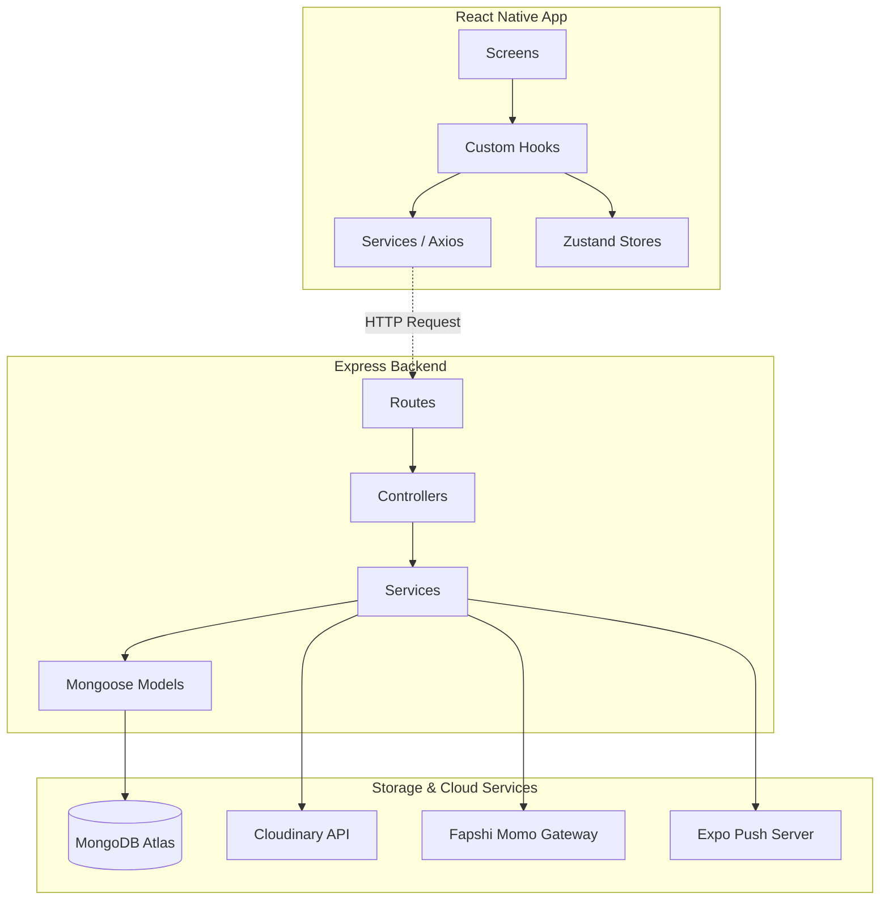

# 🛒 Online Hypermarket Commercial Center

A robust, cross-platform (Android & iOS) mobile commerce application for Cameroon markets. Features multi-role portals (Customer, Vendor, Admin), persistent shopping cart synchronization, native Mobile Money payment flows (MTN MoMo & Orange Money via Fapshi APIs), and real-time push notification updates.

---

## 🛠️ Technology Stack

| Layer | Technologies | Description |
|:---|:---|:---|
| **Mobile Client** | React Native (Expo SDK 56 + TypeScript) | Responsive UI with native features |
| **Navigation** | Expo Router (File-based) | Dynamic layout navigation |
| **State Store** | Zustand | Lightweight global store and local persistence |
| **Backend API** | Node.js + Express.js | Monolithic, modular service REST API |
| **Database** | MongoDB Atlas (M0 Free Tier) | NoSQL document store |
| **Payments** | Fapshi Gateway | Local Cameroonian Mobile Money processing |
| **Media Assets** | Cloudinary | Cloud image hosting and CDN |
| **Push Alerts** | Expo Push Notifications | Real-time order update notifications |

---

## 🏗️ Clean Architecture Overview

---

## 📖 System Documentation Links

Refer to the following guides to set up and explore the platform:

- 🚀 [Local Setup & Launch Guide](file:///c:/Users/AKUMAH98/Desktop/HYPERMARKET/docs/setup.md): Complete steps to start backend servers and boot the mobile application.
- 🔗 [API Endpoints Directory](file:///c:/Users/AKUMAH98/Desktop/HYPERMARKET/docs/endpoints.md): Table of all REST endpoints, parameters, and roles validation.
- 🔑 [Environment Configuration & Credentials](file:///c:/Users/AKUMAH98/Desktop/HYPERMARKET/docs/env.md): Required environment keys and pre-seeded tester user accounts credentials.
